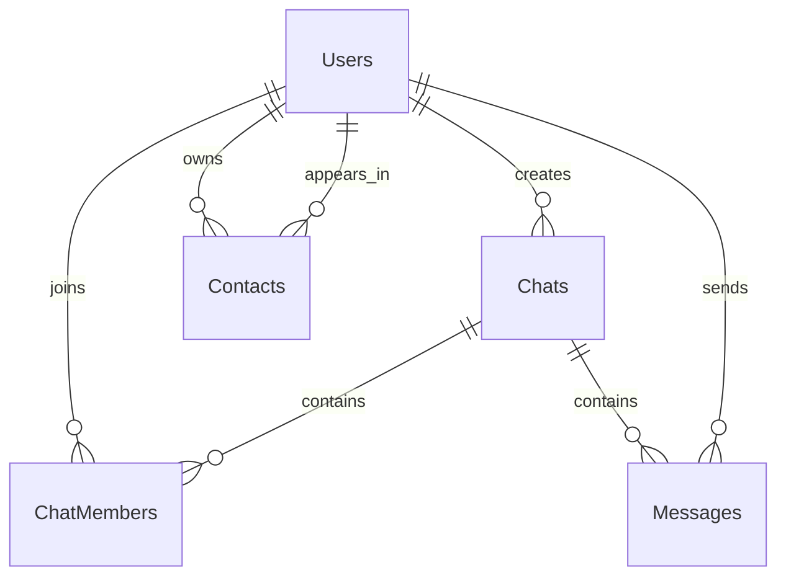

# NovaChat project review

The review covered the supplied server and desktop source, XAML and themes, configuration, DTOs, SignalR hub, web assets, and database remnants. Build caches and repository metadata are not application source.

## Architecture

| Area | Responsibility |
| --- | --- |
| `NovaChat.Server/Program.cs` | Dependency injection, MariaDB configuration, JWT auth, owner policy, schema validation, static files, routes, and SignalR |
| `Controllers` | User/profile operations; chats and groups; contacts; message deletion/editing; media; owner/admin views |
| `Services` | EF queries and writes, password hashing/verification, JWT issuance, presence, media envelopes |
| `Data` and `Entities` | Pomelo-generated EF context/entities plus persistent custom configuration and defaults |
| `Hubs/ChatHub.cs` | Authenticated connections, presence, chat groups, messaging, and notifications |
| `NovaChat.Client` | WPF login, registration, conversations, profiles, contacts, group controls, media/voice, owner tools, and themes |
| `NovaChat.Server/wwwroot` | Small mobile web/PWA prototype and uploaded media |
| `tools/NovaChat.Scaffolding` | Independent EF reverse-engineering host |
| `tests/NovaChat.DatabaseChecks` | Integration executable using production persistence sources and a real MariaDB connection |

The API is the persistence boundary. The WPF client uses REST through `ApiService` and SignalR for live events, with additional polling in partial view classes. It does not connect to MariaDB directly. User IDs remain strings in existing client/API DTOs, while database relationships now use numeric IDs.

The main view is split across many partial files for media, voice recording, group management, deletion, real-time updates, and profile UI. Those UI files were read to check their API expectations; the database conversion did not redesign them.

## Data model

The diagram shows the main relationships. A private chat additionally has nullable `User1Id` and `User2Id` foreign keys. Group chats use `ChatMembers` with nullable private-participant fields.

| Table | Important behavior |
| --- | --- |
| Users | BIGINT generated key, unique username/email/phone, Argon2id hash, profile, created/last-seen dates |
| Chats | INT generated key, private/group type, creator, optional private participants, group name/avatar |
| ChatMembers | Unique chat/user membership, integer role, join date; membership controls visibility/access |
| Messages | Chat and sender, long text, UTC sent date, global deletion flag, pipe-separated per-user deletion IDs |
| Contacts | Directed owner/contact relationship, unique pair, creation date |

Dates use `DATETIME(6)` and UTC application semantics. Tables use `utf8mb4_unicode_ci`. Phone numbers remain text to retain leading zeroes.

Image, audio, and document bytes live under `wwwroot/uploads`. Message content can contain a `__NOVACHAT_MEDIA__` JSON envelope referring to those files. A database backup alone does not contain the attachments.

## Problems addressed by this conversion

The archive already referenced Pomelo and called `UseMySql`, but several parts of the database transition were incomplete:

- User IDs were converted between CLR numbers and varchar columns, and registration scanned IDs to reuse gaps.
- Runtime and design-time database version selection differed.
- `ChatSchemaInitializer` executed raw DDL/DML at every startup, altered participant types, and recreated missing memberships. That could undo a user's hidden-conversation state.
- User deletion used raw SQL, including optional legacy `Groups`/`GroupMembers` tables that are not part of the current entity model.
- The admin deletion path directly removed a user and could fail against creator foreign keys.
- The migration directory contained comments rather than runnable migrations.
- The custom enum properties, navigation names, and defaults would not survive ordinary Pomelo reverse engineering unchanged.

These paths now use a schema generated from MariaDB, shared provider configuration, database-generated numeric IDs, EF saves and bulk operations, and explicit setup. New conversations and their initial memberships are saved together. User deletion executes all cleanup in one transaction and is used by the admin endpoint.

Normal startup reads each mapped table to fail early on missing/unreadable schema; it does not add columns or reconstruct memberships. Fresh setup is explicit.

## Scaffolding contract

Generated files are isolated from the application's partial constructors and enum definitions. The application uses Pomelo's generated `Chat.ChatMembers` navigation, `int` type/role fields, and `long` user keys. Response projections retain the enum names expected by the desktop client.

The generator runs in a small project without a server reference, so it can refresh entities even after a database change breaks the previous server model. Both platform scripts specify the five table names and keep connection secrets out of generated source.

Runtime persistence contains no hand-written SQL command path. EF LINQ and `EF.Functions.Like` handle searches; tracked entities and `SaveChangesAsync` handle ordinary edits; `ExecuteUpdateAsync` handles last-seen updates; `ExecuteDeleteAsync` handles transactional user cleanup. Initial schema SQL remains available for database administration.

## Remaining pre-existing issues and limits

These findings are separate from the database conversion and were not repaired as part of it:

| Finding | Consequence |
| --- | --- |
| ImageSharp 4.1.1 rejects the server build without a Six Labors license | Full server compilation and HTTP/media end-to-end testing remain blocked in this environment |
| Web `app.js` posts `id` for login/registration and `userId` for starting a chat, while current DTOs use login/username fields | The mobile prototype is out of sync with the current API |
| Desktop Contacts view starts a chat with an internal ID where the endpoint expects a username | Starting a new chat from that path can fail |
| Chat media endpoint checks private participant IDs | Group media can be rejected despite group membership |
| Admin per-user chat queries use the private participant fields | Group conversations can be missing from those owner views |
| Per-user message-deletion filtering happens after a bounded database fetch | Pages can underfill, and older visible messages can be missed after many hidden messages |
| Private-chat creation uses an in-process semaphore without a database-level unique conversation rule | Separate server instances can create duplicate private conversations concurrently |
| Presence is held in memory; desktop refresh timers and server address are hard-coded | Multi-server presence and deployment configuration need separate work |
| The sample `.http` file still calls the removed weather-forecast route | Use Swagger or actual API endpoints for manual checks |

The conversion preserves the existing deletion semantics: removing a user removes their private conversations, groups they created, their other messages/memberships, and their contact relationships. Groups owned by other users and those users' messages are retained. Physical upload cleanup is not implemented by the user-deletion operation.

No source database was supplied. Schema/data compatibility with a specific existing installation must be checked using the migration guide before cutover.
